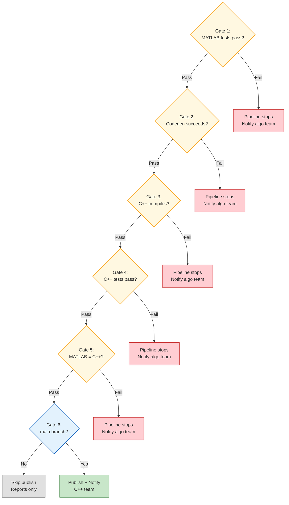

# Jenkins Pipeline Stages

```mermaid
flowchart LR
    subgraph detect ["Stage 1"]
        D[Detect<br>Changes]
    end

    subgraph test_matlab ["Stage 2"]
        TM[MATLAB<br>Tests]
    end

    subgraph codegen ["Stage 3"]
        CG[Code<br>Generation]
    end

    subgraph build ["Stage 4"]
        BC[C++<br>Build]
    end

    subgraph test_cpp ["Stage 5"]
        TC[C++<br>Tests]
    end

    subgraph equiv ["Stage 6"]
        EQ[Equivalence<br>Check]
    end

    subgraph version ["Stage 7"]
        VB[Version<br>Bump]
    end

    subgraph report ["Stage 8"]
        GR[Generate<br>Reports]
    end

    subgraph publish ["Stage 9"]
        PB[Publish<br>to Nexus]
    end

    subgraph notify_stage ["Stage 10"]
        NT[Notify<br>Teams]
    end

    D --> TM --> CG --> BC --> TC --> EQ --> VB --> GR --> PB --> NT

    style detect fill:#e3f2fd,stroke:#1565c0
    style test_matlab fill:#fff8e1,stroke:#f9a825
    style codegen fill:#fff8e1,stroke:#f9a825
    style build fill:#fff8e1,stroke:#f9a825
    style test_cpp fill:#fff8e1,stroke:#f9a825
    style equiv fill:#fff8e1,stroke:#f9a825
    style version fill:#e8f5e9,stroke:#2e7d32
    style report fill:#e8f5e9,stroke:#2e7d32
    style publish fill:#f3e5f5,stroke:#7b1fa2
    style notify_stage fill:#f3e5f5,stroke:#7b1fa2
```

## Quality Gates

## Parallel Execution

Stages 2–6 and 8 run **in parallel across algorithms**. If `kalman_filter` and `fft_processor` both changed, they are tested and built concurrently. Stage 7 (Version Bump) runs sequentially because git tags must be committed one at a time.

## Branch Behavior

| Branch | Stages 1–8 | Stage 9 (Publish) | Stage 10 (Notify) |
|--------|-----------|-------------------|-------------------|
| `main` | Run | Run | Run |
| Feature branches | Run | Skipped | Skipped |

Feature branches get full validation (build + test + equivalence) without publishing to Nexus. This gives algorithm developers confidence their changes work before merging.
