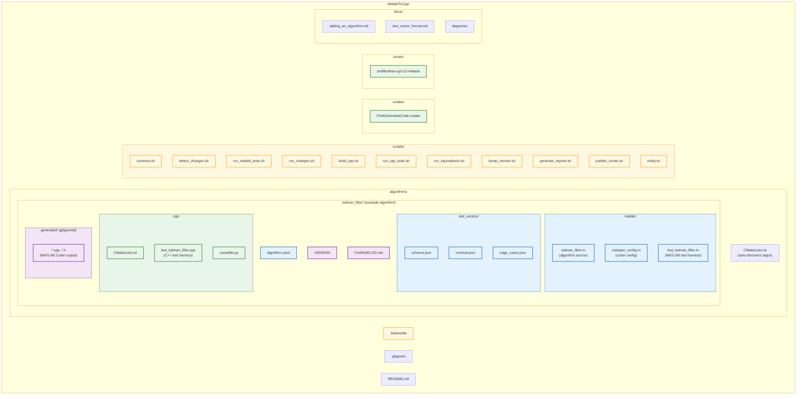

# Repository Structure

## Ownership Map

Files are color-coded by who owns them:
- **Blue** = Algorithm Team
- **Green** = C++ Team (templates, rarely modified)
- **Yellow** = Pipeline / DevOps
- **Purple** = Shared / auto-generated



## Legend

| Color | Owner | What they edit |
|-------|-------|---------------|
| Blue | Algorithm Team | MATLAB source, test vectors, codegen config, algorithm.yaml |
| Green | C++ Team / Shared | CMake files, C++ test harness, Conan recipes (rarely changes) |
| Yellow | DevOps / Pipeline | Jenkinsfile, all shell scripts |
| Purple | Auto-generated | VERSION, CHANGELOG (bumped by pipeline), generated C++ (gitignored) |

## Adding a New Algorithm

To add a new algorithm, copy the `kalman_filter/` directory:

```
algorithms/
├── kalman_filter/   <-- existing template
└── my_new_algo/     <-- copy and customize
    ├── algorithm.yaml
    ├── VERSION          (set to 0.1.0)
    ├── CHANGELOG.md
    ├── matlab/
    │   ├── my_new_algo.m
    │   ├── codegen_config.m
    │   └── test_my_new_algo.m
    ├── test_vectors/
    │   ├── schema.json
    │   └── nominal.json
    └── cpp/
        ├── CMakeLists.txt
        ├── test_my_new_algo.cpp
        └── conanfile.py
```

The top-level `algorithms/CMakeLists.txt` auto-discovers new directories — no changes needed there.
