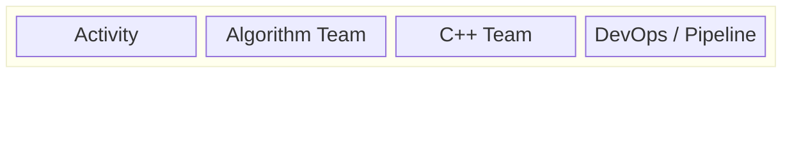
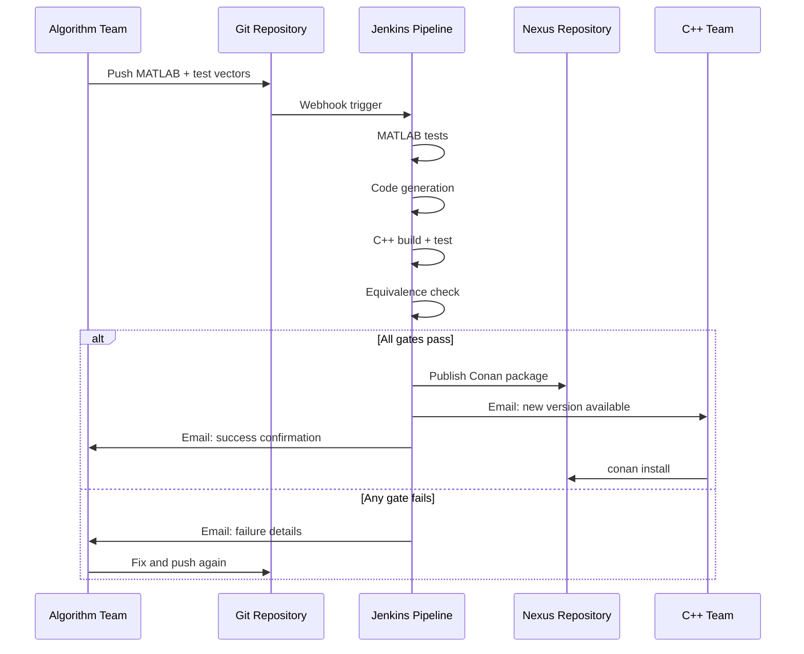

# RACI Responsibility Matrix

## Roles

| Role | Description |
|------|------------|
| **Algorithm Team** | MATLAB developers who write and maintain algorithms |
| **C++ Team** | Developers who consume the generated C++ libraries |
| **DevOps / Pipeline** | Jenkins pipeline (automated) + pipeline maintainers |

## RACI Chart

**R** = Responsible (does the work) | **A** = Accountable (owns the outcome) | **C** = Consulted | **I** = Informed

| Activity | Algorithm Team | C++ Team | DevOps / Pipeline |
|----------|:-------------:|:--------:|:-----------------:|
| **Write MATLAB algorithm** | **R, A** | I | — |
| **Define test vectors (JSON)** | **R, A** | C | — |
| **Write codegen config** | **R, A** | — | C |
| **Commit with conventional messages** | **R, A** | — | — |
| **Run MATLAB tests** | — | — | **R** (automated) |
| **Run MATLAB Coder** | — | — | **R** (automated) |
| **Build C++ (CMake)** | — | — | **R** (automated) |
| **Run C++ tests** | — | — | **R** (automated) |
| **Equivalence verification** | — | — | **R** (automated) |
| **Semantic version bump** | — | — | **R** (automated) |
| **Generate reports & diffs** | — | — | **R** (automated) |
| **Publish to Nexus** | — | — | **R** (automated) |
| **Fix pipeline failures** | **R, A** | — | C |
| **Review release notes** | I | **R** | — |
| **Consume Conan packages** | — | **R, A** | — |
| **Integrate into C++ application** | C | **R, A** | — |
| **Report C++ integration issues** | C | **R** | I |
| **Maintain pipeline scripts** | — | — | **R, A** |
| **Maintain Jenkins agents** | — | — | **R, A** |
| **Manage Nexus repository** | — | — | **R, A** |

## Key Responsibilities

### Algorithm Team owns:
- All MATLAB source code
- Test vector definitions (the "contract" between MATLAB and C++)
- Codegen configuration (input types, code generation settings)
- Fixing any pipeline failures (MATLAB bugs, codegen issues, equivalence failures)

### C++ Team owns:
- Consuming published packages via Conan
- Integrating libraries into their applications
- Reporting issues found during integration

### DevOps / Pipeline owns:
- Jenkins infrastructure and agent maintenance
- Pipeline scripts and Jenkinsfile
- Nexus repository administration
- MATLAB license management on build agents

## Handoff Points

