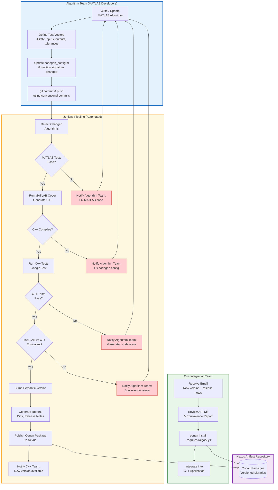

# End-to-End Workflow

## Key Points

- **Algorithm Team** only touches MATLAB code + JSON test vectors. They never write C++.
- **Jenkins** handles everything from codegen through packaging. All 6 quality gates must pass.
- **C++ Team** receives ready-to-consume Conan packages with confidence reports.
- **Failure feedback** always flows back to the Algorithm Team — they own fixing issues before code is published.
